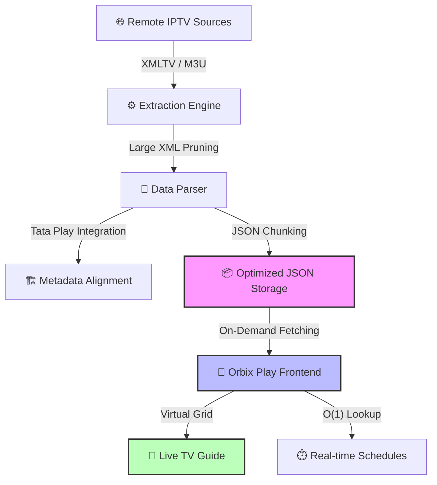

<p align="center">
  
</p>

# Orbix Play
Android app for streaming media.
### Features
- Steam and Download Ad-Free.
- Multiple sources.
- Multi Audio and Subs (Hindi, English, etc.).
- WatchList.
- External player and Downloader support.
<br>

[](https://discord.gg/cr42m6maWy)

___

## Download APK 
> <sub>Download Universal version if you are confused about armeabi-v7a or arm64-v8a or follow this guide https://vega.8man.in/guide/.</sub>

[](https://github.com/angel7544/vega-app/releases/latest)

[](https://vega.8man.in/#download)


<br>

## Add Provider source
> [!TIP]
> Follow the guide here https://vega.8man.in/guide/adding-providers/

## Screenshots


___

## Stack
<p align="left">
     
[](https://reactnative.dev/)
[](https://www.typescriptlang.org/)
[](https://www.nativewind.dev/)
[](https://reactnavigation.org/)
[](https://docs.expo.dev/modules/overview/)
[](https://thewidlarzgroup.github.io/react-native-video/)
[](https://github.com/mrousavy/react-native-mmkv)


</p>

## Build and Dev
0. Set-up React Native environment if you haven't already. [Guide](https://reactnative.dev/docs/set-up-your-environment)

1. clone
     ```bash
     git clone https://github.com/angel7544/vega-app.git
     ```
     ```
     cd vega-app
     ```
2. Install
     ```
     npm install
     ```
3. Prebuild
   ```
    npx expo prebuild -p android --clean
   ```
5. Open metro dev server
Dev
     ```
     npm run android
     ```
Build apk/aab
https://reactnative.dev/docs/signed-apk-android

---
> [!IMPORTANT]
> Orbix Play does not store any media files on our servers and is not directly linked to the media. Third-party services host all media, and Orbix Play merely provides a search and web scraping tool that indexes publicly available data. We are not responsible for the content or availability of the media, as we do not host or control any of it.


## 🚀 Recent Contributors & Technical Evolution

### 💎 Elite Contributor: Angel Mehul Singh ([@angel7544](https://github.com/angel7544))

#### 🛠️ Core Engineering & Innovations
*   **EPG Pipeline 2.0**: Engineered a high-performance extraction system that slices monolithic XML feeds into lean, on-demand JSON chunks.
*   **Tata Play Synergy**: Successfully integrated Tata Play metadata, ensuring seamless alignment with global `iptv-org` standards.
*   **Infinite Performance**: Optimized UI responsiveness via TV Guide virtualization and memory-safe parsing.
*   **Zero-Latency Lookups**: Implemented dictionary-based caching for instant (O(1)) schedule synchronization.

#### 📊 EPG Data Flow Architecture


---

> [!CAUTION]
> **LEGAL NOTICE & PRIVACY**:
> Orbix Play is a technology tool designed to provide a consolidated interface for searching and indexing content already available on the public internet. 
> - **No Hosting**: We do **not** host, store, or upload any media, files, or copyrighted material on our servers. 
> - **Source Linkage**: All content is provided via third-party services. 
> - **Internet Availability**: We merely index publicly available web data for research and convenience purposes.
> - **User Responsibility**: Usage of this software is at the user's own discretion and risk.

## Stars
 <picture>
   <source media="(prefers-color-scheme: dark)" srcset="https://api.star-history.com/svg?repos=angel7544/vega-app&type=Date&theme=dark" />
   <source media="(prefers-color-scheme: light)" srcset="https://api.star-history.com/svg?repos=angel7544/vega-app&type=Date" />
   
 </picture>
</a>
